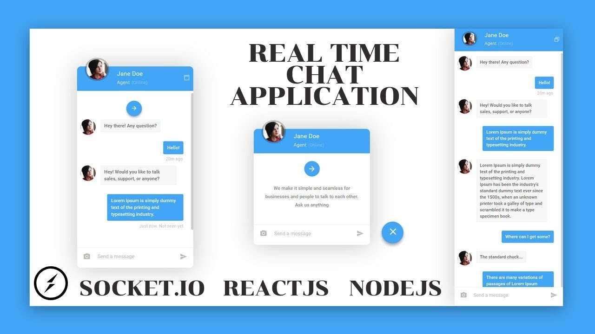

# Chat App

Realtime chatapp implemented with **socket.io** and **react** with hooks, supporting emoji and smooth scroll (auto scroll).
This procject was mainly focused in project structures, life cycle methods using hooks, and front and back end connectivity.

_Chech out the live version here: [ChatApp][liveversion]._  



## Installation
```sh
$ yarn install 
```

## Usage example
Insert your name and create a chatroom and have fun making new friends!

## Dependencies and technologies:
### back end [repository][repo]
1. NodeJS
2. socket.io
3. Express
4. Cors
5. Nodemon

### front end
1. React
2. react-router
3. socket.io-client
4. react-scroll-to-bottom
5. react-emoji
6. query-string

[repo]:https://github.com/codeecoffee/chatapp-backend
[liveversion]:https://5efe251308a6c3626f035915--vibrant-bhaskara-287957.netlify.app/